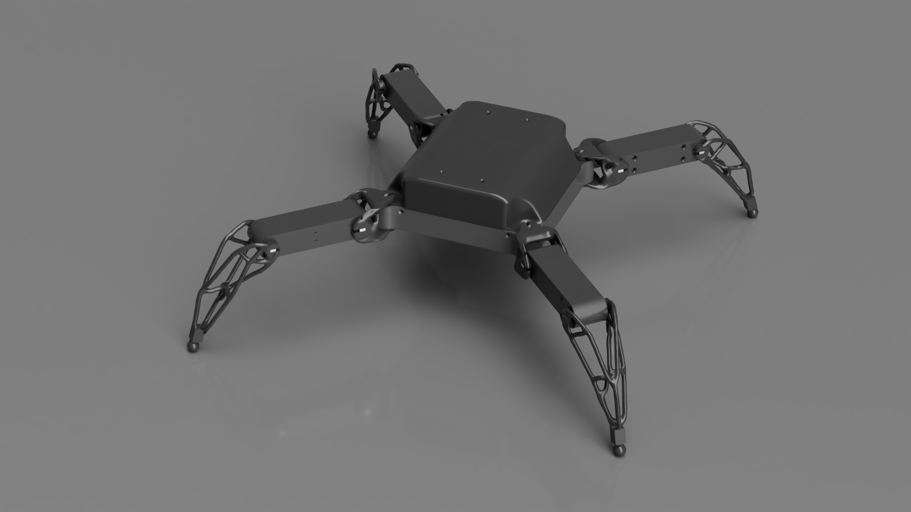
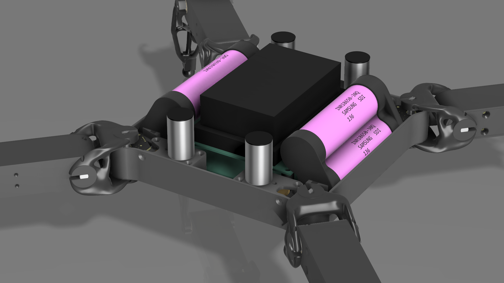
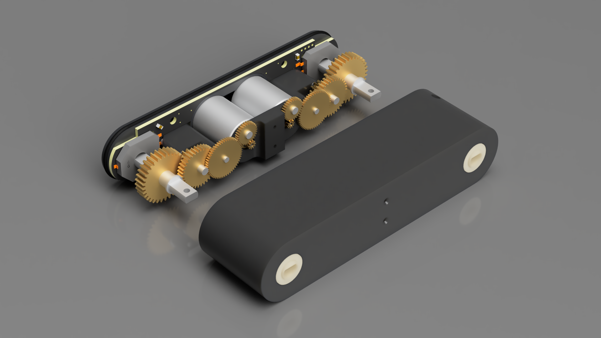

# Headcrab
The Headcrab project is my take on a serious robot project, taken from the idea to the frontend.

It's still under heavy development though, as
hardware is still being designed and tested.
Why headcrab is going to be so special?
- Innovative. The project is going to use latest technology methods such as Generative Design, custom AI on Nvidia board, using the sophisticated materials such as Igus Iglidur or Nylon PA6CF12. Fully 3D printed. (Big thanks to PCBWay for giving me the metal 3D printed gears!)
- Made by the science of tomorrow. The theory behind the robot will be based on cybernetics, which allows to determine how the robot will behave, how it will work, but most importantly - cybernetics will allow the robot to be fully autonomous. Furthermore, there will be a try to define what "emotions", "feelings", "thinking" and "imagination" are as they will be applied to the robot as well.
- Small, powerful and cheap. The legs will be powered by coreless DC motors which are cheap, allowing to pass higher power in the same package compared to traditional DC motors. BLDC motors will also be considered in the future, though.
- Aware. Each leg will have a tensometer (the sense of touch), the robot will have a camera with a microphone (sight and hearing), but also various position sensors.
- Smart. It's going to be powered by one of Nvidia's AI embedded boards, cooperating with a subprocessor for analising data in real time (thanks to FreeRTOS)
- Iconic. Most gamers and people recognize headcrabs from Half Life, and making a real one that could crawl and jump is a great challenge.

  # THIS PROJECT IS UNDER HEAVY DEVELOPMENT!
  I'm having finals soon, the scheduled resume on this project is May 2024.
  It's also going to be the subject of my bachelor's thesis (hopefully)
  
  
  

# This project wouldn't be possible to create without the generous sponsors!
https://www.pcbway.com

# License
There's no licence yet. Please do not use the content found within this repository, for both commercial and non-commercial usage of any kind. Ask me if you really need to
